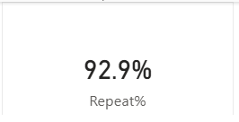

# E-commerce Sales Analysis (SQL & Power BI)

## Project Overview
This project analyzes e-commerce transactional data using **SQL (SQLite)** and **Power BI** to evaluate business performance and answer key business questions related to **revenue, product performance, and customer behavior**.

The objective of this project is to demonstrate practical SQL skills and the ability to translate data into **business insights**, rather than focusing only on raw metrics.

---

## Tools & Technologies

- SQLite – query execution and database
- Power BI – KPI dashboard visualization
- Markdown – documentation

---

## Project Structure

```text
ecommerce-sales-analysis/
├── data/
│   └── ecommerce.db
├── sql/
│   ├── kpi_01_total_revenue.sql
│   ├── kpi_02_monthly_revenue.sql
│   ├── kpi_03_top_5_products.sql
│   ├── kpi_04_bottom_5_products.sql
│   └── kpi_05_repeat_customers.sql
├── images/
│   ├── overview_dashboard.png
│   ├── monthly_revenue.png
│   ├── top_5_products_by_revenue.png
│   └── repeat_customers.png
└── README.md
```
---

## Business Questions & Analysis

### KPI 1: Total Revenue
**Business Question:**  
What is the total revenue from all orders?

**Purpose:**  
To understand the overall dataset and use it as a foundation for further business analysis.

---

### KPI 2: Monthly Revenue Trend
**Business Question:**  
What is the total revenue by month?


**Insight:**  
Revenue in **November is noticeably lower** compared to other months.  
This may indicate seasonal purchasing behavior, where customers delay purchases while waiting for major promotional periods later in the year.

**Business Implication:**  
While waiting for major promotional campaigns, the business could consider offering price discounts on low-performing products toward the end of the year to help increase product sales and improve revenue in November.

---

### KPI 3: Top 5 Products by Revenue
**Business Question:**  
Which are the top 5 products by revenue?


**Insight:**  
A small number of products contribute a large proportion of total revenue, indicating revenue concentration.

**Business Implication:**  
Product performance should be evaluated using multiple factors, such as sales volume, revenue, profit margin, and the impact of promotional activities, rather than relying on a single metric.

---

### KPI 4: Bottom 5 Products by Revenue
**Business Question:**  
Which are the bottom 5 products by revenue?

**Insight:**  
Low-selling products may be affected by a lack of promotions, limited marketing exposure, or higher prices per unit.

**Business Implication:**  
Promotional campaigns or price discounts could be implemented for low-performing products to help increase sales.

---

### KPI 5: Repeat Customers
**Business Question:**  
How many repeat customers are there?



**Insight:**  
A high number of repeat customers may be driven by promotional campaigns or member-only discounts, which encourage customers to return and make repeat purchases.

**Business Implication:**  
Offering discounts on future purchases could help strengthen customer loyalty and encourage repeat buying behavior.

---

## Dashboard Overview


The Power BI dashboard consolidates all KPIs into a single view, allowing stakeholders to quickly monitor revenue trends, product performance, and customer behavior.

---

## Conclusion
This project demonstrates the ability to:
- Write structured SQL queries to answer real business questions
- Analyze data beyond surface-level metrics
- Communicate insights with clear business implications

The analysis highlights opportunities in **promotion timing, product strategy, and customer retention**, which are key drivers of business performance.

---

## Future Improvements
- Expand analysis using a larger dataset
- Perform customer segmentation
- Analyze customer lifetime value (CLV)
- Evaluate the impact of promotions on revenue
