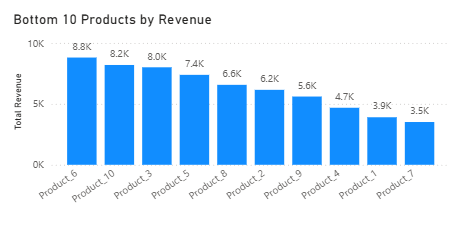

# E-commerce Sales Analysis

## Project Overview
This project analyzes e-commerce sales data using SQL (SQLite) and Power BI to evaluate business performance and identify actionable business insights related to revenue trends, product performance, and customer behavior.

## Tools & Technologies
- SQL (SQLite)
- Power BI
- CSV Dataset

## Dataset
The dataset includes order-level, product-level, and customer-level data, which are used to analyze monthly sales performance, identify low-performing products, and evaluate repeat customer behavior.

## Dashboard Overview

## Key Insights

### 1. Monthly Revenue Trend
Sales in November are the lowest compared to other months. This decline may be due to the absence of promotional campaigns, as customers could be waiting for year-end promotions.

### 2. Low-performing Products
Products with low sales do not necessarily indicate poor product quality. Lower sales performance may be influenced by higher prices, leading to lower purchase frequency compared to other products. This suggests opportunities for pricing adjustments or targeted promotional strategies.

### 3. Repeat Customers
All customers in the dataset are repeat customers, indicating strong customer retention. However, this result may be influenced by the limited dataset size. Offering discounts or incentives for subsequent purchases could help increase revenue from repeat customers.

## Conclusion
This analysis provides a high-level overview of e-commerce business performance and highlights potential opportunities to improve revenue through promotional timing, product pricing strategies, and customer retention initiatives.
