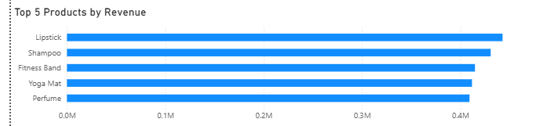
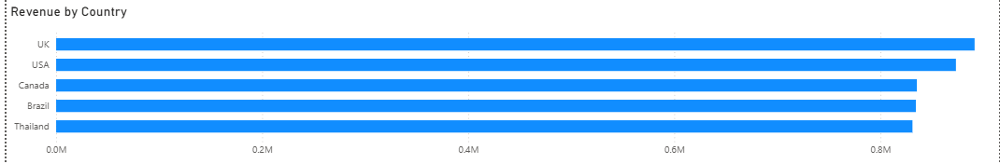
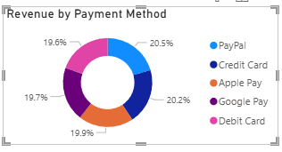
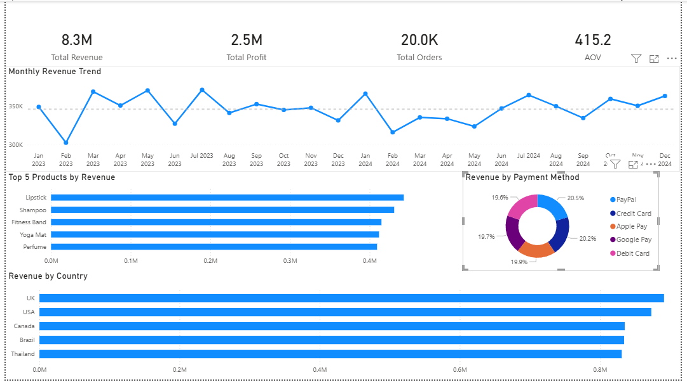

# E-commerce Sales Analysis (SQL & Power BI)

## Project Overview
This project analyzes e-commerce transactional data using **SQL (SQLite)** and **Power BI** to evaluate business performance and answer key business questions related to **revenue, product performance, and customer behavior**.

The objective of this project is to demonstrate practical SQL skills and the ability to translate data into **business insights**, rather than focusing only on raw metrics.

---

## Objectives
- Analyze revenue trends over time
- Identify top and bottom performing products
- Understand repeat customer behavior
- Present insights through an interactive dashboard

---

## Tools & Technologies
- SQL (JOINs, aggregations, date functions, window functions)
- SQLite
- Power BI (data visualization)
- Excel (basic data exploration)

---

## Project Structure

```text
ecommerce-sales-analysis/
├── data/
│   └── ecommerce_analysis.db
├── sql/
│   ├── kpi_01_total_revenue.sql
│   ├── kpi_02_monthly_revenue.sql
│   ├── kpi_03_top_5_products.sql
│   ├── kpi_04_bottom_5_products.sql
│   ├── kpi_05_repeat_customers.sql
│   ├── kpi_06_revenue_by_country.sql
│   ├── kpi_07_most_profitable_products.sql
│   ├── kpi_09_top_products_per_category.sql
│   ├── kpi_10_average_order_value.sql
│   ├── kpi_11_customer_lifetime_value.sql
│   ├── kpi_12_revenue_growth_rate.sql
│   ├── kpi_13_running_total_revenue.sql
│   ├── kpi_14_customer_revenue_rank.sql
│   └── kpi_15_top_products_per_month.sql
├── powerbi/
│   └── PortBi.pbix
├── images/
│   ├── data_model.png
│   ├── monthly_revenue_trend.png
│   ├── overview_dashboard.png
│   ├── payment_method.png
│   ├── revenue_by_country.png
│   └── top_5_products.png
└── README.md
```
## Data Model


The dataset consists of several relational tables representing customers, orders, products, and payments.
```
## Key KPIs

This project analyzes 15 key performance indicators (KPIs) to evaluate business performance from multiple perspectives including revenue, customer behavior, and product performance.

- Total Revenue
- Monthly Revenue
- Top 5 Products by Revenue
- Bottom 5 Products by Revenue
- Repeat Customers
- Revenue by Country
- Most Profitable Products
- Payment Method Usage
- Top Products per Category
- Average Order Value (AOV)
- Customer Lifetime Value (CLV)
- Revenue Growth Rate
- Running Total Revenue
- Customer Revenue Rank
- Top Products per Month

---

## How to Use
1. Open the SQLite database in `data/ecommerce.db`
2. Run the SQL queries in the `sql/` folder
3. Review output using your query tool or BI tool
 
---

## Key Analysis
The analysis focuses on key business metrics including:

- Total revenue and revenue trends
- Product performance analysis
- Customer purchase behavior
- Payment method distribution
- Customer value metrics
---

## Business Questions & Analysis

### KPI 1: Monthly Revenue Trend

Business Question:
How does monthly revenue change over time?

)

Insight:
Revenue consistently drops in February across both years,
falling below the average monthly revenue level.

Business Implication:
Promotions or targeted discounts in February may help
stimulate demand and improve revenue during this period.

---

### KPI 2: Top 5 Products by Revenue
**Business Question:**  
Which products generate the highest revenue?



**Insight:**  
A small number of products contribute a large share of total revenue,
suggesting that sales are concentrated among a few top-performing items.

**Business Implication:**  
Promotional campaigns for lower-performing products may help diversify
revenue and reduce dependence on a small set of products.

---

### KPI 3: Revenue by Country
**Business Question:**  
Which country contributes the most revenue?



**Insight:**  
The UK generates the highest revenue, while other countries
show relatively similar revenue levels.

**Business Implication:**  
Localized promotions or marketing campaigns in lower-performing
countries may help increase sales and expand market reach.

---

### KPI 4: Revenue by Payment Method
**Business Question:**  
Which payment method generates the most revenue?



**Insight:**  
Revenue distribution across payment methods is relatively balanced,
with each method contributing a similar share of total revenue.

**Business Implication:**  
Maintaining multiple payment options can help improve customer
convenience and support a wider range of purchasing preferences.

---

## Dashboard Overview


The Power BI dashboard consolidates all KPIs into a single view, allowing stakeholders to quickly monitor revenue trends, product performance, and customer behavior.

---

## Conclusion
This project demonstrates the ability to:
- Write structured SQL queries to answer real business questions
- Analyze data beyond surface-level metrics
- Communicate insights with clear business implications

The analysis highlights opportunities in **promotion timing, product strategy, and customer retention**, which are key drivers of business performance.

---

## Future Improvements
- Expand analysis using a larger dataset
- Perform customer segmentation
- Analyze customer lifetime value (CLV)
- Evaluate the impact of promotions on revenue
- Build a predictive model to forecast future revenue trends

## Author

Name: Charinthon Rattanawaraha
Role: Junior Data Analyst (Aspiring)  
Skills: SQL, Data Analysis, Power BI
