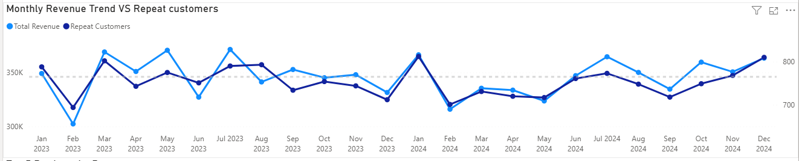
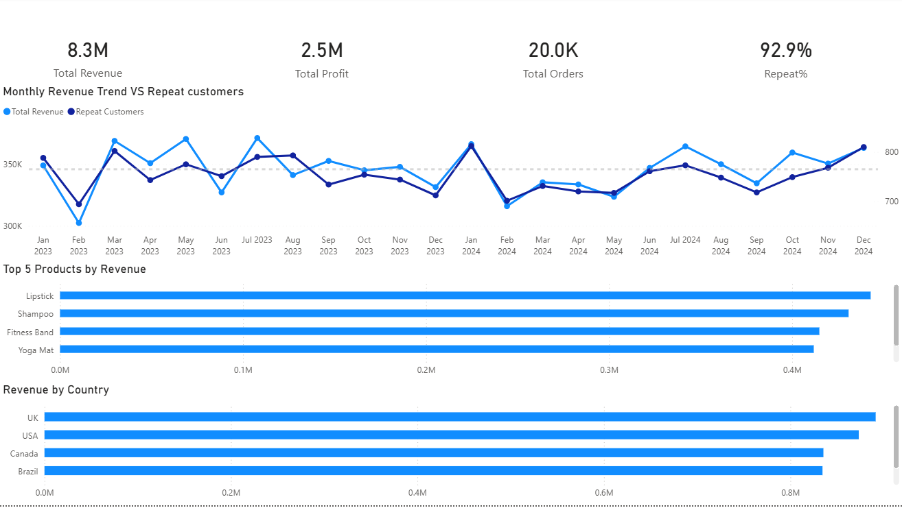

# E-commerce Sales Analysis (SQL & Power BI)

## Project Overview
This project analyzes e-commerce transactional data using **SQL (SQLite)** and **Power BI** to evaluate business performance and answer key business questions related to **revenue, product performance, and customer behavior**.

The objective of this project is to demonstrate practical SQL skills and the ability to translate data into **business insights**, rather than focusing only on raw metrics.

---

## Objectives
- Analyze revenue trends over time
- Identify top and bottom performing products
- Understand repeat customer behavior
- Present insights through an interactive dashboard

---

## Tools & Technologies
- SQL (JOINs, aggregations, date functions, window functions)
- SQLite
- Power BI (data visualization)
- Excel (basic data exploration)

---

## Project Structure

```text
ecommerce-sales-analysis/
├── data/
│   └── ecommerce_analysis.db
├── sql/
│   ├── kpi_01_total_revenue.sql
│   ├── kpi_02_monthly_revenue.sql
│   ├── kpi_03_top_5_products.sql
│   ├── kpi_04_bottom_5_products.sql
│   ├── kpi_05_repeat_customers.sql
│   ├── kpi_06_revenue_by_country.sql
│   ├── kpi_07_most_profitable_products.sql
│   ├── kpi_09_top_products_per_category.sql
│   ├── kpi_10_average_order_value.sql
│   ├── kpi_11_customer_lifetime_value.sql
│   ├── kpi_12_revenue_growth_rate.sql
│   ├── kpi_13_running_total_revenue.sql
│   ├── kpi_14_customer_revenue_rank.sql
│   └── kpi_15_top_products_per_month.sql
├── powerbi/
│   └── PortBi.pbix
├── images/
│   ├── data_model.png
│   ├── monthly_revenue_trend.png
│   ├── overview_dashboard.png
│   ├── payment_method.png
│   ├── revenue_by_country.png
│   └── top_5_products.png
└── README.md
```
## Data Model


The dataset consists of several relational tables representing customers, orders, products, and payments.
```
## Key KPIs

This project analyzes 15 key performance indicators (KPIs) to evaluate business performance from multiple perspectives including revenue, customer behavior, and product performance.

- Total Revenue
- Monthly Revenue
- Top 5 Products by Revenue
- Bottom 5 Products by Revenue
- Repeat Customers
- Revenue by Country
- Most Profitable Products
- Payment Method Usage
- Top Products per Category
- Average Order Value (AOV)
- Customer Lifetime Value (CLV)
- Revenue Growth Rate
- Running Total Revenue
- Customer Revenue Rank
- Top Products per Month

---

## How to Use
1. Open the SQLite database in `data/ecommerce.db`
2. Run the SQL queries in the `sql/` folder
3. Review output using your query tool or BI tool
 
---

## Key Analysis
The analysis focuses on key business metrics including:

- Total revenue and revenue trends
- Product performance analysis
- Customer purchase behavior
- Payment method distribution
- Customer value metrics
---

## Business Questions & Analysis
```
### KPI 1: Monthly Revenue Trend

Business Question:
How does monthly revenue change over time?



**Insight:**  
Revenue consistently declines in February across multiple years, suggesting a recurring seasonal pattern rather than a one-time fluctuation.

**Possible Explanation:**  
This decline may be driven by reduced consumer spending following the New Year period, where customers tend to spend more in January and subsequently reduce their purchasing activity.

**Business Implication:**  
To mitigate this seasonal slowdown, the business could introduce targeted promotions, discounts, or bundled offers in February to stimulate demand and stabilize revenue.

---

### KPI 2: Repeat Customers
**Business Question:**  
How many customers return to make repeat purchases?


**Insight:**  
A high proportion of customers are repeat buyers, indicating strong loyalty to the brand and products.

**Possible Explanation:**  
Repeat purchases suggest that the customer experience and product quality meet expectations. To further grow revenue, strategies such as promotions, membership programs, or targeted retention campaigns could encourage more first-time buyers to return.

**Business Implication:**  
The business should continue nurturing loyal customers while implementing initiatives to convert new buyers into repeat customers, thereby increasing overall revenue and ensuring long-term sustainability.

---

### KPI 3: Top 5 Products by Revenue
**Business Question:**  
Which products generate the highest revenue?


**Insight:**  
Top-performing products are predominantly concentrated in the skincare category (e.g., lipstick, shampoo, perfume), indicating that a significant portion of revenue is driven by a specific product segment.

**Possible Explanation:**  
This pattern suggests that customer demand is heavily skewed toward personal care and beauty products, potentially driven by consistent consumption behavior and repeat purchases within this category.

**Business Implication:**  
The business could implement bundling strategies by pairing high-performing skincare products with lower-performing items to increase overall sales and encourage cross-category purchases.

---

### KPI 4: Revenue by Country
**Business Question:**  
Which country contributes the most revenue?


**Insight:**  
Revenue is highly concentrated in the UK and USA, while other countries contribute at relatively similar but lower levels, indicating an imbalance in revenue distribution.

**Possible Explanation:**  
This may be driven by a stronger customer base or more effective marketing presence in the UK and USA compared to other regions.

**Business Implication:**  
A decline in sales from these key markets could significantly impact overall revenue. Therefore, the business should consider expanding its presence in other countries to diversify revenue streams and reduce dependency on a limited number of markets

---

## Dashboard Overview
<p align="center">
  
</p>

The Power BI dashboard consolidates all KPIs into a single view, allowing stakeholders to quickly monitor revenue trends, product performance, and customer behavior.
---

## Key Insights
- Revenue shows monthly fluctuation with seasonal peaks
- Top 5 products generate a significant share of revenue
- Repeat customers contribute strongly to total revenue
- Payment methods are relatively evenly distributed
- 
---

## Conclusion
This project demonstrates the ability to:
- Write structured SQL queries to answer real business questions
- Analyze data beyond surface-level metrics
- Communicate insights with clear business implications

The analysis highlights opportunities in **promotion timing, product strategy, and customer retention**, which are key drivers of business performance.

---

## Future Improvements
- Expand analysis using a larger dataset
- Perform customer segmentation
- Analyze customer lifetime value (CLV)
- Evaluate the impact of promotions on revenue
- Build a predictive model to forecast future revenue trends

## Author

Name: Charinthon Rattanawaraha
Role: Junior Data Analyst (Aspiring)  
Skills: SQL, Data Analysis, Power BI

