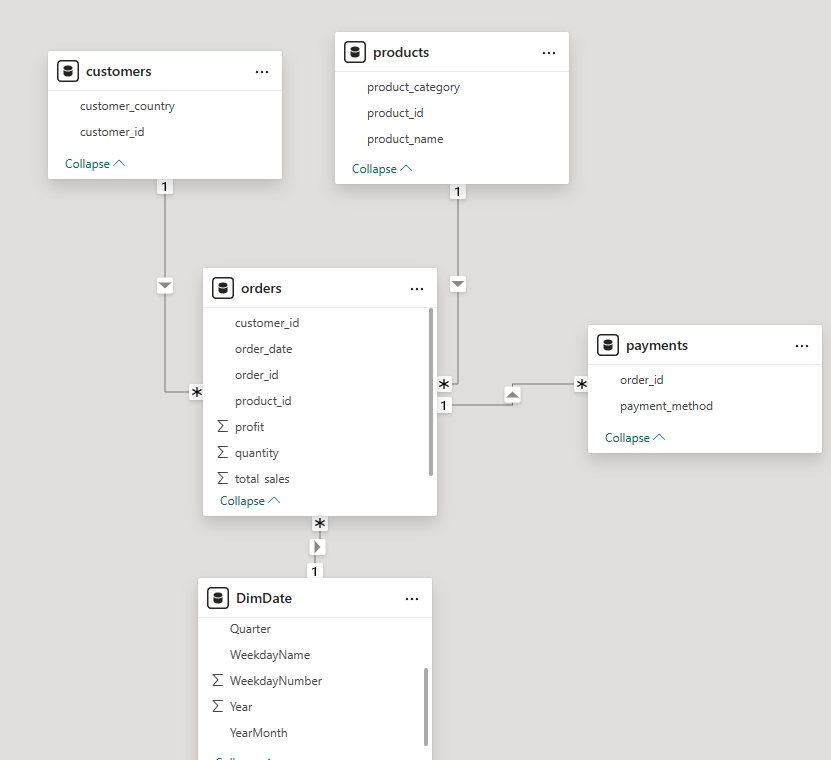
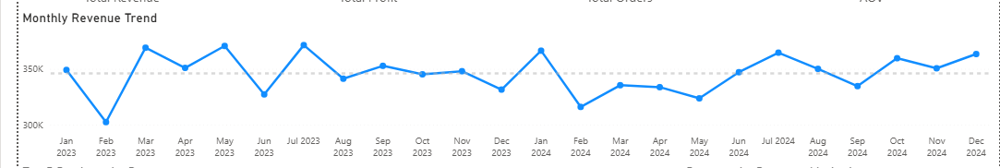
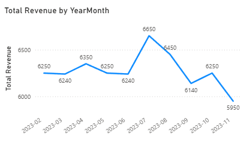
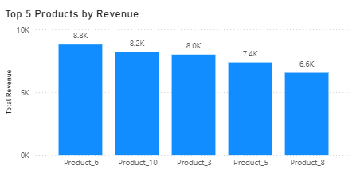
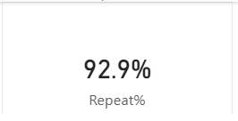
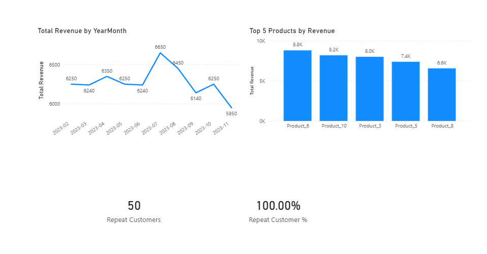

# E-commerce Sales Analysis (SQL & Power BI)

## Project Overview
This project analyzes e-commerce transactional data using **SQL (SQLite)** and **Power BI** to evaluate business performance and answer key business questions related to **revenue, product performance, and customer behavior**.

The objective of this project is to demonstrate practical SQL skills and the ability to translate data into **business insights**, rather than focusing only on raw metrics.

---

## Objectives
- Analyze revenue trends over time
- Identify top and bottom performing products
- Understand repeat customer behavior
- Present insights through an interactive dashboard

---

## Tools & Technologies
- SQL (JOINs, aggregations, date functions, window functions)
- SQLite
- Power BI (data visualization)
- Excel (basic data exploration)

---

## Project Structure

```text
ecommerce-sales-analysis/
├── data/
│   └── ecommerce_analysis.db
├── sql/
│   ├── kpi_01_total_revenue.sql
│   ├── kpi_02_monthly_revenue.sql
│   ├── kpi_03_top_5_products.sql
│   ├── kpi_04_bottom_5_products.sql
│   ├── kpi_05_repeat_customers.sql
│   ├── kpi_06_revenue_by_country.sql
│   ├── kpi_07_most_profitable_products.sql
│   ├── kpi_09_top_products_per_category.sql
│   ├── kpi_10_average_order_value.sql
│   ├── kpi_11_customer_lifetime_value.sql
│   ├── kpi_12_revenue_growth_rate.sql
│   ├── kpi_13_running_total_revenue.sql
│   ├── kpi_14_customer_revenue_rank.sql
│   └── kpi_15_top_products_per_month.sql
├── powerbi/
│   └── PortBi.pbix
├── images/
│   ├── data_model.png
│   ├── monthly_revenue_trand.png
│   ├── overview_dashborad.png
│   ├── payment_method.png
│   ├── revenue_by_country.png
│   └── top_5_products.png
└── README.md
```
## Data Model



The dataset consists of several relational tables representing customers, orders, products, and payments.
```
## Key KPIs

This project analyzes 15 key performance indicators (KPIs) to evaluate business performance from multiple perspectives including revenue, customer behavior, and product performance.

- Total Revenue
- Monthly Revenue
- Top 5 Products by Revenue
- Bottom 5 Products by Revenue
- Repeat Customers
- Revenue by Country
- Most Profitable Products
- Payment Method Usage
- Top Products per Category
- Average Order Value (AOV)
- Customer Lifetime Value (CLV)
- Revenue Growth Rate
- Running Total Revenue
- Customer Revenue Rank
- Top Products per Month

---

## How to Use
1. Open the SQLite database in `data/ecommerce.db`
2. Run the SQL queries in the `sql/` folder
3. Review output using your query tool or BI tool
 
---

## Key Analysis
The analysis focuses on key business metrics including:

- Total revenue and revenue trends
- Product performance analysis
- Customer purchase behavior
- Payment method distribution
- Customer value metrics
---

## Business Questions & Analysis

### KPI: Monthly Revenue Trend

Business Question:
How does revenue change over time?



Insight:
Revenue declines slightly in November compared to surrounding months.

Business Implication:
The company may consider running pre-holiday promotions or discounts
to maintain revenue momentum before major shopping periods.

---

### KPI 2: Monthly Revenue Trend
**Business Question:**  
What is the total revenue by month?



**Insight:**  
Revenue in **November is noticeably lower** compared to other months.  
This may indicate seasonal purchasing behavior, where customers delay purchases while waiting for major promotional periods later in the year.

**Business Implication:**  
While waiting for major promotional campaigns, the business could consider offering price discounts on low-performing products toward the end of the year to help increase product sales and improve revenue in November.

---

### KPI 3: Top 5 Products by Revenue
**Business Question:**  
Which are the top 5 products by revenue?



**Insight:**  
A small number of products contribute a large proportion of total revenue, indicating revenue concentration.

**Business Implication:**  
Product performance should be evaluated using multiple factors, such as sales volume, revenue, profit margin, and the impact of promotional activities, rather than relying on a single metric.

---

### KPI 4: Bottom 5 Products by Revenue
**Business Question:**  
Which are the bottom 5 products by revenue?

**Insight:**  
Low-selling products may be affected by a lack of promotions, limited marketing exposure, or higher prices per unit.

**Business Implication:**  
Promotional campaigns or price discounts could be implemented for low-performing products to help increase sales.

---

### KPI 5: Repeat Customers
**Business Question:**  
How many repeat customers are there?



**Insight:**  
A high number of repeat customers may be driven by promotional campaigns or member-only discounts, which encourage customers to return and make repeat purchases.

**Business Implication:**  
Offering discounts on future purchases could help strengthen customer loyalty and encourage repeat buying behavior.

---

## Dashboard Overview


The Power BI dashboard consolidates all KPIs into a single view, allowing stakeholders to quickly monitor revenue trends, product performance, and customer behavior.

---

## Conclusion
This project demonstrates the ability to:
- Write structured SQL queries to answer real business questions
- Analyze data beyond surface-level metrics
- Communicate insights with clear business implications

The analysis highlights opportunities in **promotion timing, product strategy, and customer retention**, which are key drivers of business performance.

---

## Future Improvements
- Expand analysis using a larger dataset
- Perform customer segmentation
- Analyze customer lifetime value (CLV)
- Evaluate the impact of promotions on revenue
